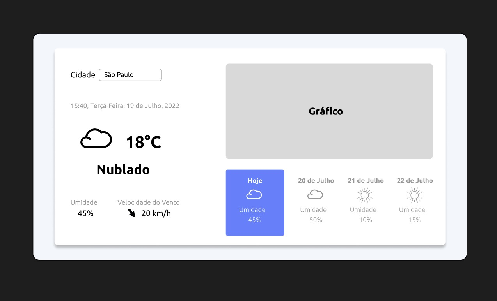

<h1 align="center">🌤 Wheater App</h1>



> 🔎 A website that consumes a weather weather api.

Check out the app: https://www.linkedin.com/in/kayke-fujinaka/ <br>

## :page_facing_up: Explanation
The project is a challenge proposed by the Academy leaders in the GCB Group. It was performed through a Pair Programming.

The project is for a website that presents weather information from anywhere in the world, with the option of choosing that location through the search field. It displays the location's humidity information in percentage, the wind speed, the current location's weather and how many degrees. In addition to presenting an icon simulating time.

It gives you the option to watch the forecast for a few days in the future. So you can click and switch to view future options.

The graph changes as the user chooses the desired location or the day he wants to see.

The data is being consumed from an API called WheaterAPI which offers some services for projects like this or even bigger.

## 📁 Pages

The site has one page, which is:

- **Home:** The main page is the only one of the project and it presents some information, such as: a search field that locates any place in the world, a section that presents the data of the chosen place, a graph with location information and a weather forecast for the next few days of the location.

## ⚔️ Challenge

In this challenge, you have to build a website that will show the weather in places around the world! The application must be built using the consumption of an API that will provide the necessary data to display on your website. A very good challenge to learn the whole context of front-end applications using React.

## 🎯 Steps

:heavy_check_mark: Project Installations/Configuration\
:heavy_check_mark: Component structuring\
:heavy_check_mark: Component styling\
:heavy_check_mark: Creating the Project Layout\
:heavy_check_mark: Responsive\
:heavy_check_mark: Functionality when clicking on Cards\
:heavy_check_mark: Storybook of components\
:heavy_check_mark: Jest of components\
:heavy_check_mark: API Consumption\
:heavy_check_mark: Loading\
:heavy_check_mark: Consuming API\
:heavy_check_mark: Jest\
:heavy_check_mark: Storybook\
:heavy_check_mark: Done\

## 🚀 Technologies

- [TypeScript](https://www.typescriptlang.org/docs/)
- [NextJs](https://nextjs.org/docs)
- [Eslint](https://eslint.org/docs/latest/user-guide/getting-started)
- [Prettier](https://prettier.io/docs/en/)
- [Styled Components](https://styled-components.com/docs)
- [Storybook](https://storybook.js.org/docs/ember/get-started/introduction)
- [Jest](https://jestjs.io/pt-BR/docs/getting-started)
- [Testing Library](https://testing-library.com/docs/react-testing-library/intro/)
- [Axios](https://axios-http.com/docs/intro)
- [Chartjs](https://www.chartjs.org/)
- [BabelJs](https://babeljs.io/)

## 📡 API'𝘀 used in the application

- 🌤 [Wheaterbit](https://www.weatherbit.io/)

## :closed_book: How to use it?

Before starting, you need to have [Git](https://git-scm.com) and [Node](https://nodejs.org/en/) installed.

```bash
# Clone this project
$ git clone https://github.com/Kayke-Fujinaka/Wheather-App
# access
$ cd wheater-app
# install dependencies
$ yarn or npm
# Run the project
$ yarn start or npm start
# The server will initialize in the <http://localhost:3000>
```

## 🤝 Collaborators

Thanks to the following people who contributed to this project:

<table>
  <tr>
    <td align="center">
      <a href="#">
        <br>
        <sub>
          <b>Kayke Fujinaka</b>
        </sub>
      </a>
    </all>
    <td align="center">
      <a href="#">
        <br>
        <sub>
          <b>Ismael Gomes da Silva</b>
        </sub>
      </a>
    </all>
  </tr>
</table>

## 📝 License

This project is under license. See the [LICENSE](LICENSE.md) file for more details.

&#xa0;

<a href="#top">Go back to top</a>
